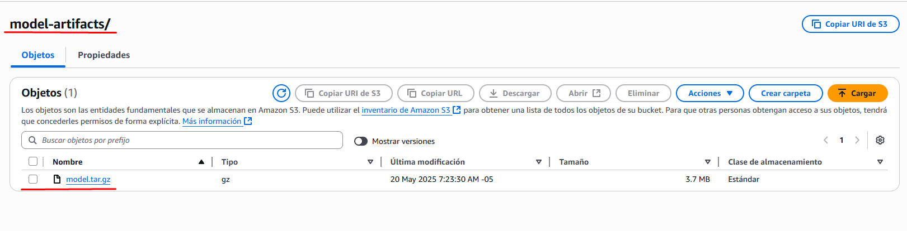

# Paso 1: Alcance del proyecto y captura de datos  
1. Identificar y recopilar los datos que usarás para tu proyecto.  
   El DataSet seleccionado es StackSample: 10% of Stack Overflow Q&A Data, que contiene preguntas y respuestas de Stack Overflow. Este conjunto de datos es ideal para el análisis de texto y la clasificación de preguntas y respuestas.  (Paso 2)
2. Limpiar los datos para dejarlos disponibles para entrenar un modelo de Machine learning que prediga las tags de la pregunta con base en su contenido.  (Paso 4)
3. Entrenar el modelo de machine learning del punto anterior.  (Paso 5)
4. Evaluar este modelo.  (Paso 5)
5. Desplegar el modelo en un entorno de producción.  (Paso 5)
6. Realizar una propuesta de monitoreo y seguridad del modelo.  (Paso 6)

# Paso 2: Explorar y evaluar los datos, el EDA  
En el notebook llamado “EDA/EDAStackOverFlow.ipynb” se llevaron a cabo los siguientes pasos:  
1. Definición de funciones.  
2. Lectura de los datos.  
3. Exploración de los datos.  
4. Revisión de la calidad de los datos.  

Estos pasos los explico a detalle dentro del archivo “EDA/EDAStackOverFlow.ipynb”.  

# Paso 3: Definir el modelo de datos  
1. Trazar el modelo de datos conceptual y explicar por qué se eligió ese modelo.  
     
   Se eligió este modelo conceptual porque tiene una estructura clara y comprensible, definiendo las entidades principales (preguntas, tags y respuestas); adicionalmente, nos facilita la comprensión respecto a las relaciones entre las entidades y cómo se pueden consultar y analizar.  

2. Diseñar la arquitectura y los recursos utilizados.  
     

3. Elegí Python porque es el lenguaje recomendado por el documento de la prueba técnica y porque es un lenguaje que manejo bastante bien. El uso de notebooks se debe a que me parece una herramienta sencilla de usar, a la que estoy acostumbrado y que me da la facilidad de tener un entorno aislado sin mucho esfuerzo.  

   Por otro lado, respecto a las tecnologías y herramientas utilizadas:  
   - Amazon S3: Almacenamiento de datos en la nube que es muy eficiente y tiene un costo bajo.  
   - Amazon SageMaker: Plataforma de machine learning para entrenar y desplegar modelos que brinda muchas facilidades para el desarrollo ML.  
   - Amazon Glue: Servicio de ETL (Extracción, Transformación y Carga) para preparar los datos de forma serveless sin tener que preocuparme de la infraestructura.  
   - Amazon StepFunctions: Orquestación de flujos de trabajo de forma visual y facil, otra buena opcion puede ser lambda pero por la sencilles de la prueba tecnica opte por esta opcion.  
   - Amazon EventBridge: Servicio de mensajería y eventos que nos permite disparar las stepfunctions.  

   Todas estas tecnologías se complementan bien para generar un flujo de ML simple.  

4. Esta implementación nos permite entrenar un modelo de ML siempre que se tengan nuevos datos en el bucket de raw_data, mientras que, cuando se necesite realizar alguna inferencia, se puede cargar los datos al bucket de inference.  

# Paso 4: Ejecutar la ETL  
Para la ejecución del ETL, guardé los datos en un bucket S3.  
  
Luego hice un job en Spark para que éste limpiara los datos y los dejara listos para el entrenamiento del modelo.  
  
El codigo del GlueJob está en el archivo glue/etlGlue.py
# Paso 5: Entrenar, evaluar y desplegar el modelo  
Utilizamos un notebook de SageMaker para realizar todo el entrenamiento, evaluación y despliegue del modelo.  

El código está en el archivo "sageMakerTraining/train.ipynb", en el cual se entrena un modelo de clasificación de texto. El modelo se entrena con los datos de preguntas y etiquetas extraídos del conjunto de datos de Stack Overflow. Se utiliza la biblioteca scikit-learn para dividir los datos en conjuntos de entrenamiento y prueba.  
  

Guardamos los artefactos del modelo en S3.  
  

Realizamos un pipeline con la ejecución del notebook de entrenamiento para que éste se ejecute cada vez que se necesite.  
  

Utilizamos una StepFunction para orquestar el flujo de trabajo y que éste se ejecute cada vez que se necesite realizar un entrenamiento.  
  
  

Utilizamos una StepFunction para orquestar el flujo de trabajo y que éste se ejecute cada vez que se necesite realizar una inferencia en batch.  
  

Para el versionamiento del código del notebook se utiliza Git y GitHub directamente desde el notebook. Adicionalmente, los buckets de S3 están totalmente versionados, por lo que siempre se podrá acceder a la versión de los datos que se usaron para entrenar el modelo.  
  
  

# Paso 6: Monitoreo y seguridad  
Como propuesta de monitoreo y seguridad del modelo, se recomienda implementar las siguientes medidas:  

1. **Monitoreo operativo:**  
   - Ingesta (S3 Raw_data):  
     - Nº de archivos recibidos: Permite verificar que la ingesta cumple con el volumen esperado y detectar caídas o picos inusuales (por ejemplo, generación masiva de datos corruptos), facilitando una respuesta rápida. 
   - ETL (AWS Glue/StepFunctions):  
     - Jobs completados vs. fallidos: Mide la fiabilidad del pipeline. Un ratio de fallos elevado indica errores recurrentes en scripts, permisos o esquemas, y ayuda a priorizar correcciones.
     - Tiempo medio de ejecución: Detecta degradaciones de rendimiento y permite dimensionar recursos (número de DPUs, concurrencia) para cumplir con SLA de latencia.
   - Entrenamiento (SageMaker):  
     - Estado de los Training Jobs (Completed/Failed): Ofrece visibilidad sobre la frecuencia de fallos de entrenamiento (p. ej. por datos corruptos o hiperparámetros inválidos) y acelera el diagnóstico. 
     - Uso de CPU/GPU y memoria: Informa sobre la eficiencia del cluster de entrenamiento. Si el GPU está infrautilizado o la CPU saturada, se pueden ajustar instancias o batch sizes para optimizar costes y tiempos.
   - Model Registry:  
     - Nuevas versiones registradas: Documenta cada cambio en el modelo (dataset, parámetros, métricas) para auditoría y reproducibilidad, facilitando rollback si es necesario.  
     - Promociones a “producción” vs. “staging”: Controla el flujo de validación: asegura que solo modelos testeados y aprobados lleguen a producción, reduciendo el riesgo de degradación en entorno real.
   - Inferencia Batch:  
     - Jobs completados vs. fallidos: Garantiza la fiabilidad del proceso de scoring masivo. Fallos recurrentes pueden indicar problemas en el código de inferencia o en el formato de entrada. 
     - Tiempo total de procesamiento: Es clave para planificar ventanas batch (fin de día, reportes) y dimensionar instancias para evitar retrasos que impacten a los consumidores.
   - Herramienta central:  
     - Un único CloudWatch Dashboard “ML-Pipeline” que consolide todas las métricas anteriores: Consolida todas las métricas en un solo panel, agiliza la visión end-to-end de la salud del pipeline y facilita el reporting a equipos de negocio y operaciones.

2. **Alertas y acciones correctivas automatizables:**  
   - Nueva ingesta > umbral de tamaño:  
     - Motivo: Detecta archivos atípicamente grandes (posible corrupción o ataque de denegación de servicio) y evita procesar datos maliciosos o fuera de especificación.
     - Alarma: S3.PutObjectSize > X MB → SNS (e-mail / Slack).  
   - Fallo en ETL:  
     - Motivo: Detecta errores en la transformación de datos (p. ej. permisos, esquemas) y permite una respuesta rápida para evitar caídas en el pipeline.
     - Alarma: GlueJobFailed > 0 → SNS + PagerDuty.  
     - Acción automática: StepFunction reintenta job.  
   - Training Job FAIL o muy lento:  
     - motivo : Detecta problemas en el entrenamiento (p. ej. datos corruptos, hiperparámetros inválidos) y permite una respuesta rápida para evitar caídas en el pipeline.
     - Alarma: SageMakerTrainingJobFailed o duración > 2× baseline → SNS.  
   - Data drift detectado (Model Monitor):  
     - Motivo: Detecta cambios en la distribución de datos de entrada (p. ej. cambios en el comportamiento del usuario) y permite una respuesta rápida para evitar caídas en el pipeline.
     - Alarma: DataQualityMonitorDetectionAlert → SNS.  
     - Acción automática: Step Functions lanza pipeline de reentrenamiento.  

3. **Controles y buenas prácticas de seguridad:**  
   - IAM & separación de entornos: 
     - Porque es buena práctica: educe el impacto de brechas y evita accesos indebidos entre entornos. 
     - Roles con principio de mínimo privilegio para Glue, SageMaker, StepFunction.  
     - Cuentas/roles distintos para dev, test y prod, gestionados vía AWS Organizations.  
   - Red y comunicaciones seguras:  
     - Porque es buena práctica: protege la infraestructura y los datos de accesos no autorizados.
     - Comunicaciones cifradas.  
   - Cifrado de datos
     - Porque es buena práctica: protege la confidencialidad e integridad de los datos.
     - SSE-KMS en todos los buckets S3.  
     - Cifrado en tránsito por defecto.  
     - Credenciales y secretos en Secrets Manager o Parameter Store (KMS).  
   - Auditoría & detección de anomalías:  
     - Porque es buena práctica: permite detectar y responder a incidentes de seguridad.
     - CloudTrail habilitado y logs enviados a un S3 de auditoría.  
     - AWS Config + Security Hub para compliance continuo.  
     - GuardDuty para detección de actividades sospechosas.  
   - Protección del ML:  
     - Porque es buena práctica: Para detectar ataques o cambios de patrón antes de que dañen el negocio.
     - Model Monitor para drift de datos y predicciones.  
   - Resiliencia y recuperación:  
     - Porque es buena práctica: asegura la continuidad del negocio y minimiza el impacto de incidentes.
     - Orquestación con Step Functions usando retry y catch.  

Versionado estricto de código y artefactos (CodeCommit/CodePipeline).  

# Paso 7: Completar la redacción del proyecto  
Como cierre del proyecto, se pueden destacar los siguientes puntos:  

**Resumen de logros:**  
- Ingesta y limpieza automática de datos de Stack Overflow.  
- Entrenamiento y despliegue continuo de un clasificador de tags con SageMaker.  
- Orquestación completa (EventBridge → Step Functions → Glue/SageMaker).  

**Impacto esperado:**  
- Reducción de esfuerzo manual en preparación e inferencia.  
- Mayor fiabilidad gracias a métricas, alarmas y rollbacks automáticos.  
- Trazabilidad total de datos, modelos y versiones.  

**Próximos pasos:**  
- Añadir tests automáticos de performance y robustez.  
- Incluir un dashboard de detección de sesgos.  
- Con esto, el flujo de ML queda cerrado, seguro y fácilmente mantenible y escalable.  
